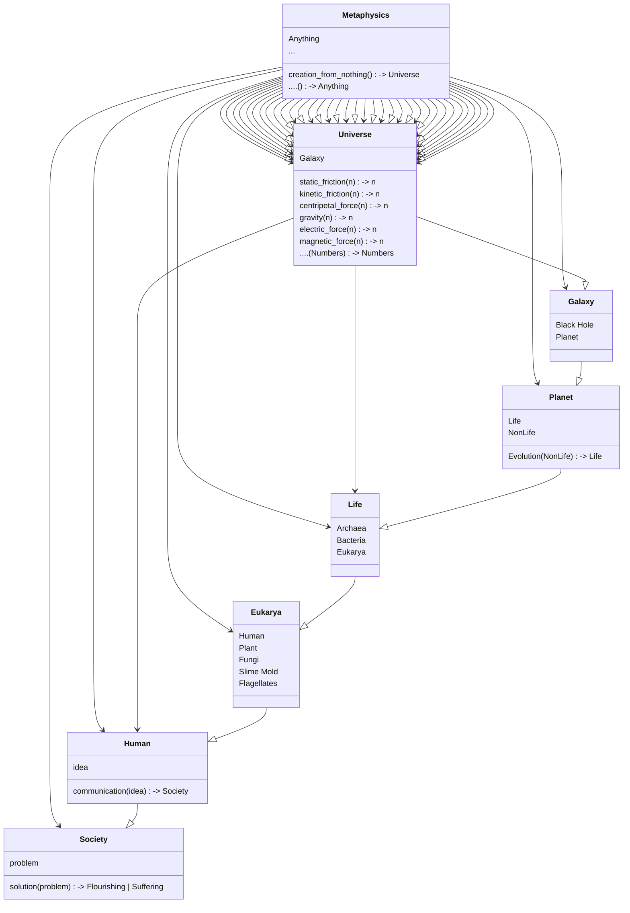
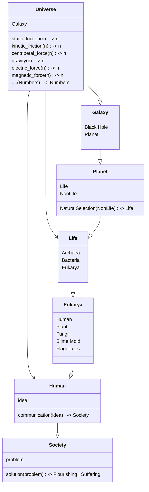
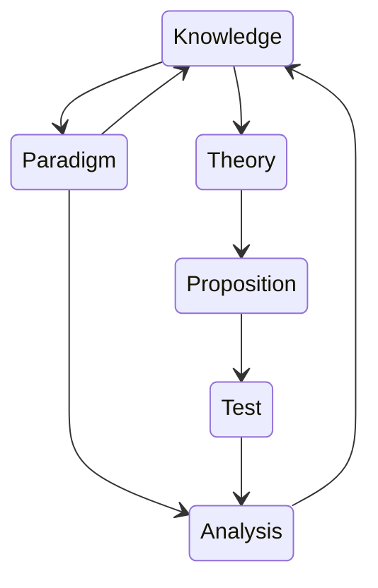

# Method

Explore an Idea

Goals:

0. Cooperatively explore topics which matter to people around me.

Assumptions:

0. Positive feeling precedes cooperative communication.
0. Not all disagreements can be resolved.
0. Disagreement does not necessitate conflict.
0. Not all conflicts can be resolved.
0. Cooperation can maximize value for all parties even when conflict is irreconcilable.

Rules:

0. Follow a "Tomato Clock" /w breaks.
   - Play / Break / LongBreak
   - 9 / 3 / 9
   - 20 / 5 / 20
0. Anyone can stop the conversation for any reason with a TimeOut or a GameOver
  - Person who initiates GameOver must leave the space within a reasonable timeframe.
  - TimeOut can be started with hand or verbal signal and everyone must stop talking immediately.
  - Timeout lasts for the duration of a LongBreak or until TimeIn is called by same person.
  - Each player get's 2 TimeOuts per game.
0. One person speaks at a time.
0. Non-normatively (excluding "positivism").
   - "No should-ing on others" - but evidence of a claim is expected if asked for.

## Overview

0. Clarify Values
0. Formulate Problem Statement
0. Formulate Goal
0. Identify Causal Factors
0. Consider Theory
0. Formulate Action Plan
0. Consider Resolution
0. Ratify Resolution

### Theory

0. Develop Ontology
   - Forces
   - Objects
   - Events
0. Validate Epistemology
   - Intuitive
   - Bayesian
0. Consider Ethical Implications
   - Personal
   - Institutional

---

## Example

### Values

- Individual Flourishing
- Collaboration

### Problem

> Coming to a clear understanding of any problem using Metaphysics is not reliable.

### Goal

> Create a Problem Solving Game based on "Positive Methodology".

### Propositions

 - Metaphysics form an unreliable foundation for solving problems.

 - Metaphysical Ontology does not allow for clear linking of causal relationships.

 - Relationships which used to be explained by Metaphysics are now explained by Physics.
    - This is because problems with Physics can be demonstrated and explored in relatively unambiguous terms, and by using models which rely on mathematics to ensure logical coherence.

 - Metaphysics are not "bad" - just indeterminate.

### Metaphysical Ontology

> Applying "Occam's Razor" makes the ontology easier to deal with:

### Positive Epistemology

It is important to recognize our `Fundamental Ignorance` which leaves open the possibility for new discovery. 

A valid model is not expected to explain everything.

> Note that we can only update our Knowledge by executing a Test or (Axiomatically) by exploring a Paradigm.

 - `Knowledge` == Sensible information stored in human memory.
 - `Paradigm` == Predictive Models /w explanation; taken to be true.
 - `Theory` == Provisional models which fit with a given paradigm.
 - `Proposition` == Statement which can be tested.
 - `Test` == Method of testing propositions.
 - `Analysis` == Consider what the test means in relationship to the working paradigm.

### Positive Ethics

 - Ethics is a highly speculative subject.
 - Much of the subject is based on metaphysical concepts.
 - Legal Positivism is a highly relevant.
 - Sociology is dubious, and becoming more positive over time.

#### Pragmatics

...