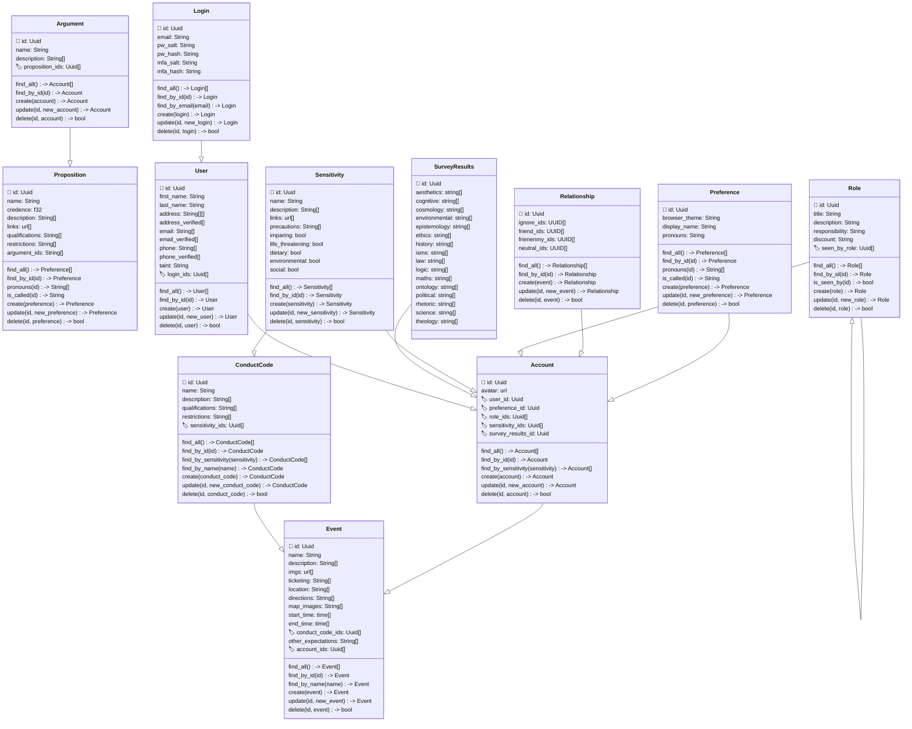

# WTF Events Schema

Events my be hosted by WTF or a 3rd party.

```mermaid
classDiagram
    class Account{
        🔑 id: Uuid
        avatar: url
        🏷️ user_id: Uuid
        🏷️ preference_id: Uuid
        🏷️ role_ids: Uuid[]
        🏷️ sensitivity_ids: Uuid[]
        🏷️ survey_results_id: Uuid
        find_all() -> Account[]
        find_by_id(id) -> Account
        find_by_sensitivity(sensitivity) -> Account[]
        create(account) -> Account
        update(id, new_account) -> Account
        delete(id, account) -> bool
    }
    Account --|> Event

    class Argument{
        🔑 id: Uuid
        name: String
        description: String[]
        🏷️ proposition_ids: Uuid[]
        find_all() -> Account[]
        find_by_id(id) -> Account
        create(account) -> Account
        update(id, new_account) -> Account
        delete(id, account) -> bool
    }
    Argument --|> Proposition

    class ConductCode{
        🔑 id: Uuid
        name: String
        description: String[]
        qualifications: String[]
        restrictions: String[]
        🏷️ sensitivity_ids: Uuid[]
        find_all() -> ConductCode[]
        find_by_id(id) -> ConductCode
        find_by_sensitivity(sensitivity) -> ConductCode[]
        find_by_name(name) -> ConductCode
        create(conduct_code) -> ConductCode
        update(id, new_conduct_code) -> ConductCode
        delete(id, conduct_code) -> bool
    }
    ConductCode --|> Event

    class Event{
        🔑 id: Uuid
        name: String
        description: String[]
        imgs: url[]
        ticketing: String[]
        location: String[]
        directions: String[]
        map_images: String[]
        start_time: time[]
        end_time: time[]
        🏷️ conduct_code_ids: Uuid[]
        other_expectations: String[]
        🏷️ account_ids: Uuid[]
        find_all() -> Event[]
        find_by_id(id) -> Event
        find_by_name(name) -> Event
        create(event) -> Event
        update(id, new_event) -> Event
        delete(id, event) -> bool
    }

    class Login{
        🔑 id: Uuid
        email: String
        pw_salt: String
        pw_hash: String
        mfa_salt: String
        mfa_hash: String
        find_all() -> Login[]
        find_by_id(id) -> Login
        find_by_email(email) -> Login
        create(login) -> Login
        update(id, new_login) -> Login
        delete(id, login) -> bool
    }
    Login --|> User

    class Preference{
        🔑 id: Uuid
        browser_theme: String
        display_name: String
        pronouns: String
        find_all() -> Preference[]
        find_by_id(id) -> Preference
        pronouns(id) -> String[]
        is_called(id) -> String
        create(preference) -> Preference
        update(id, new_preference) -> Preference
        delete(id, preference) -> bool
    }
    Preference --|> Account

    class Proposition{
        🔑 id: Uuid
        name: String
        credence: f32
        description: String[]
        links: url[]
        qualifications: String[]
        restrictions: String[]
        argument_ids: String[]
        find_all() -> Preference[]
        find_by_id(id) -> Preference
        pronouns(id) -> String[]
        is_called(id) -> String
        create(preference) -> Preference
        update(id, new_preference) -> Preference
        delete(id, preference) -> bool
    }

    class Relationship{
        🔑 id: Uuid
        ignore_ids: UUID[]
        friend_ids: UUID[]
        frienenmy_ids: UUID[]
        neutral_ids: UUID[]
        find_all() -> Relationship[]
        find_by_id(id) -> Relationship
        create(event) -> Relationship
        update(id, new_event) -> Relationship
        delete(id, event) -> bool
    }
    Relationship --|> Account

    class Role{
        🔑 id: Uuid
        title: String
        description: String
        responsibility: String
        discount: String
        🏷️ seen_by_role: Uuid[]
        find_all() -> Role[]
        find_by_id(id) -> Role
        is_seen_by(id) -> bool
        create(role) -> Role
        update(id, new_role) -> Role
        delete(id, role) -> bool
    }
    Role --|> Account
    Role --|> Role

    class Sensitivity{
        🔑 id: Uuid
        name: String
        description: String[]
        links: url[]
        precautions: String[]
        imparing: bool
        life_threatening: bool
        dietary: bool
        environmental: bool
        social: bool
        find_all() -> Sensitivity[]
        find_by_id(id) -> Sensitivity
        create(sensitivity) -> Sensitivity
        update(id, new_sensitivity) -> Sensitivity
        delete(id, sensitivity) -> bool
    }
    Sensitivity --|> Account
    Sensitivity --|> ConductCode

    class SurveyResults{
        🔑 id: Uuid
        aesthetics: string[]
        cognitive: string[]
        cosmology: string[]
        environmental: string[]
        epistemology: string[]
        ethics: string[]
        history: string[]
        isms: string[]
        law: string[]
        logic: string[]
        maths: string[]
        ontology: string[]
        political: string[]
        rhetoric: string[]
        science: string[]
        theology: string[]
    }
    SurveyResults --|> Account

    class User{
        🔑 id: Uuid
        first_name: String
        last_name: String
        address: String[][]
        address_verified[]
        email: String[]
        email_verified[]
        phone: String[]
        phone_verified[]
        taint: String
        🏷️ login_ids: Uuid[]
        find_all() -> User[]
        find_by_id(id) -> User
        create(user) -> User
        update(id, new_user) -> User
        delete(id, user) -> bool
    }
    User --|> Account
```